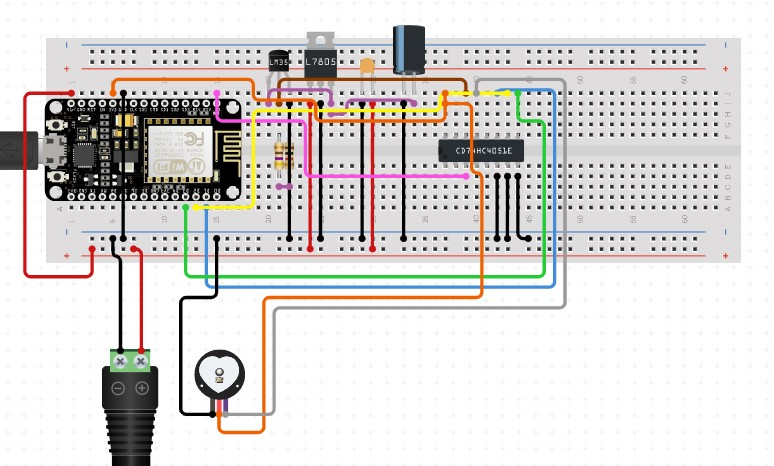

# Smart-Tracker
A smart band to track a persons location which can be used to enforce quarantine in an area.

## Components used:
* ESP32
* TMP36 (For the hardware due to constraints an mpu was used)
* MAX30100 Pulse Oximetry Sensor

### Prototype
 

## Made By:
* [Pulkit Mahajan](https://github.com/pulkitmahajan23)
* [Nishith Nayan](https://github.com/nishithnayan)
* [Sakshi Sinha](https://github.com/sakshisinha13)
* [Yili Shivani](https://github.com/lazy2code)
* [Shashikant Patel](https://github.com/shashikant-patel)